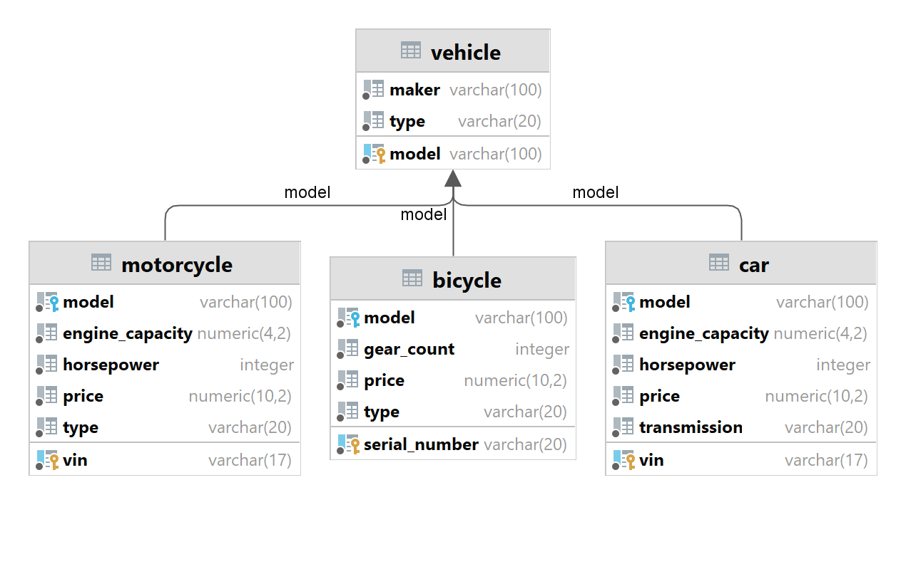
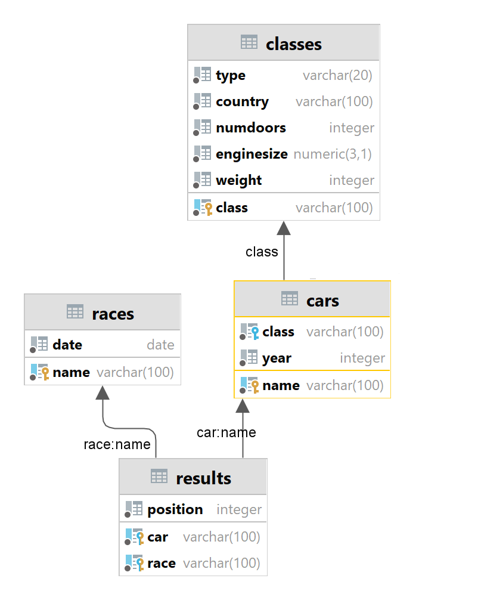
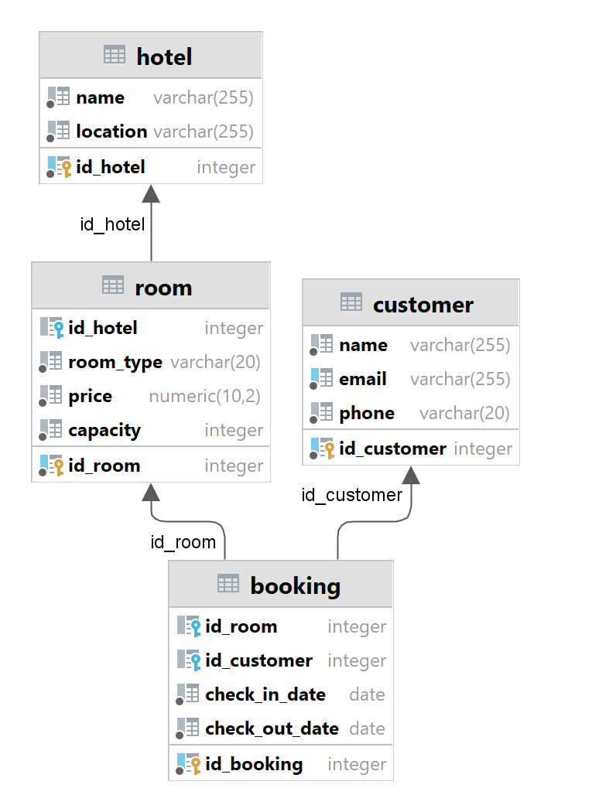
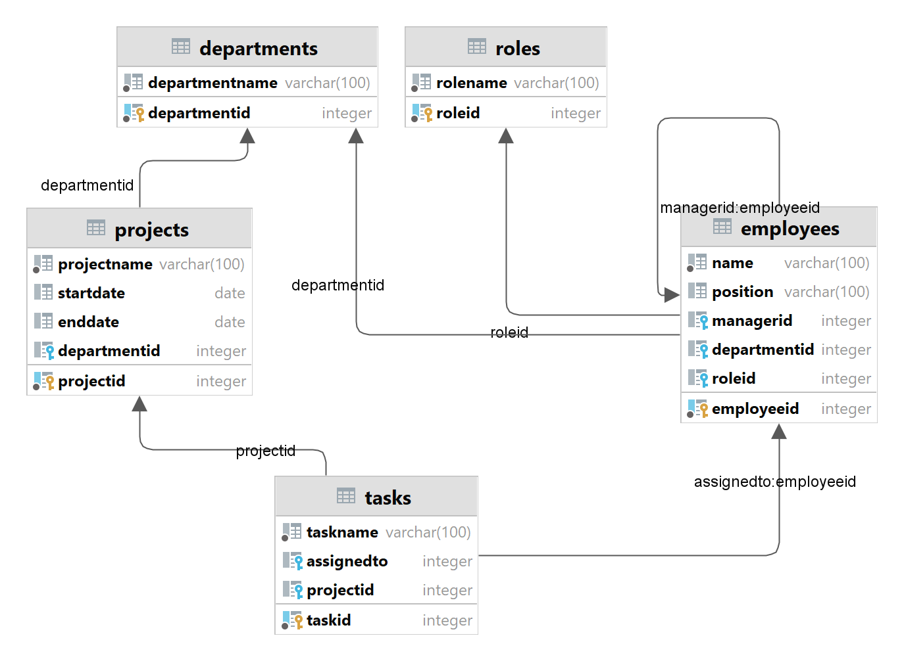

# Домашнее задание по дисциплине База данных

## Описание
Проект решения домашнего задания по дисциплине База данных. В задании 13 задач, каждая из которых относится к одной
из четырех баз данных:
* Транспортные средства
* Автомобильные гонки
* Бронирование отелей
* Структура организации

### Размещение решений
| БД                        | Задача   | Скрипт решения  |
|---------------------------|----------|-----------------|
| 1. Транспортные средства  | Задача 1 | db1/01_task.sql |
| 1. Транспортные средства  | Задача 2 | db1/02_task.sql |
| 2. Автомобильные гонки    | Задача 1 | db2/01_task.sql |
| 2. Автомобильные гонки    | Задача 2 | db2/02_task.sql |
| 2. Автомобильные гонки    | Задача 3 | db2/03_task.sql |
| 2. Автомобильные гонки    | Задача 4 | db2/04_task.sql |
| 2. Автомобильные гонки    | Задача 5 | db2/05_task.sql |
| 3. Бронирование отелей    | Задача 1 | db3/01_task.sql |
| 3. Бронирование отелей    | Задача 2 | db3/02_task.sql |
| 3. Бронирование отелей    | Задача 3 | db3/03_task.sql |
| 4. Структура организации  | Задача 1 | db4/01_task.sql |
| 4. Структура организации  | Задача 2 | db4/02_task.sql |
| 4. Структура организации  | Задача 3 | db4/03_task.sql |

## Требования
* PostgreSQL 17

## Порядок запуска
* Выполнить скрипт инициализации 00_init.sql соответствующей базы данных 
* Выполнить скрипт решения задачи _task.sql 

## Условия задач
### База данных 1. Транспортные средства

#### Задача 1. 
Условие:
Найдите производителей (maker) и модели всех мотоциклов, которые имеют мощность более 150 лошадиных сил,
стоят менее 20 тысяч долларов и являются спортивными (тип Sport). Также отсортируйте результаты
по мощности в порядке убывания.

#### Задача 2.
Условие:
Найти информацию о производителях и моделях различных типов транспортных средств
(автомобили, мотоциклы и велосипеды), которые соответствуют заданным критериям.

Автомобили:
Извлечь данные о всех автомобилях, которые имеют:

Мощность двигателя более 150 лошадиных сил.
Объем двигателя менее 3 литров.
Цену менее 35 тысяч долларов.
В выводе должны быть указаны производитель (maker), номер модели (model),
мощность (horsepower), объем двигателя (engine_capacity)
и тип транспортного средства, который будет обозначен как Car.

Мотоциклы:
Извлечь данные о всех мотоциклах, которые имеют:

Мощность двигателя более 150 лошадиных сил.
Объем двигателя менее 1,5 литров.
Цену менее 20 тысяч долларов.
В выводе должны быть указаны производитель (maker), номер модели (model),
мощность (horsepower), объем двигателя (engine_capacity)
и тип транспортного средства, который будет обозначен как Motorcycle.

Велосипеды:
Извлечь данные обо всех велосипедах, которые имеют:

Количество передач больше 18.
Цену менее 4 тысяч долларов.
В выводе должны быть указаны производитель (maker), номер модели (model),
а также NULL для мощности и объема двигателя, так как эти характеристики
не применимы для велосипедов. Тип транспортного средства будет обозначен как Bicycle.

Сортировка:
Результаты должны быть объединены в один набор данных и отсортированы
по мощности в порядке убывания. Для велосипедов,
у которых нет значения мощности, они будут располагаться внизу списка.

## База данных 2. Автомобильные гонки.

#### Задача 1.
Условие:
Определить, какие автомобили из каждого класса имеют наименьшую среднюю позицию в гонках,
и вывести информацию о каждом таком автомобиле для данного класса, включая его класс,
среднюю позицию и количество гонок, в которых он участвовал.
Также отсортировать результаты по средней позиции.

#### Задача 2.
Условие:
Определить автомобиль, который имеет наименьшую среднюю позицию в гонках среди всех автомобилей,
и вывести информацию об этом автомобиле, включая его класс, среднюю позицию, количество гонок,
в которых он участвовал, и страну производства класса автомобиля.
Если несколько автомобилей имеют одинаковую наименьшую среднюю позицию,
выбрать один из них по алфавиту (по имени автомобиля).

#### Задача 3.
Условие:
Определить классы автомобилей, которые имеют наименьшую среднюю позицию в гонках,
и вывести информацию о каждом автомобиле из этих классов, включая его имя,
среднюю позицию, количество гонок, в которых он участвовал, страну производства
класса автомобиля, а также общее количество гонок, в которых участвовали
автомобили этих классов.
Если несколько классов имеют одинаковую среднюю позицию, выбрать все из них.

#### Задача 4.
Условие:
Определить, какие автомобили имеют среднюю позицию лучше (меньше) средней позиции
всех автомобилей в своем классе (то есть автомобилей в классе должно быть минимум два,
чтобы выбрать один из них). Вывести информацию об этих автомобилях, включая их имя,
класс, среднюю позицию, количество гонок, в которых они участвовали, и
страну производства класса автомобиля.
Также отсортировать результаты по классу и затем по средней позиции в порядке возрастания.

#### Задача 5.
Условие:
Определить, какие классы автомобилей имеют наибольшее количество автомобилей с
низкой средней позицией (больше 3.0) и вывести информацию о каждом автомобиле
из этих классов, включая его имя, класс, среднюю позицию, количество гонок,
в которых он участвовал, страну производства класса автомобиля, а также
общее количество гонок для каждого класса. Отсортировать результаты по
количеству автомобилей с низкой средней позицией.

## База данных 3. Бронирование отелей.

#### Задача 1.
Условие:
Определить, какие клиенты сделали более двух бронирований в разных отелях,
и вывести информацию о каждом таком клиенте, включая его имя, электронную почту,
телефон, общее количество бронирований, а также список отелей, в которых
они бронировали номера (объединенные в одно поле через запятую с помощью CONCAT).
Также подсчитать среднюю длительность их пребывания (в днях) по всем бронированиям.
Отсортировать результаты по количеству бронирований в порядке убывания.

#### Задача 2.
Условие:
Необходимо провести анализ клиентов, которые сделали более двух бронирований в разных
отелях и потратили более 500 долларов на свои бронирования.
Для этого:
Определить клиентов, которые сделали более двух бронирований и забронировали
номера в более чем одном отеле. Вывести для каждого такого клиента следующие данные:
ID_customer, имя, общее количество бронирований, общее количество уникальных отелей,
в которых они бронировали номера, и общую сумму, потраченную на бронирования.
Также определить клиентов, которые потратили более 500 долларов на бронирования,
и вывести для них ID_customer, имя, общую сумму, потраченную на бронирования,
и общее количество бронирований.
В результате объединить данные из первых двух пунктов, чтобы получить список клиентов,
которые соответствуют условиям обоих запросов. Отобразить поля: ID_customer, имя,
общее количество бронирований, общую сумму, потраченную на бронирования,
и общее количество уникальных отелей.
Результаты отсортировать по общей сумме, потраченной клиентами, в порядке убывания.

#### Задача 3.
Условие:
Вам необходимо провести анализ данных о бронированиях в отелях и определить предпочтения
клиентов по типу отелей. Для этого выполните следующие шаги:

Категоризация отелей.
Определите категорию каждого отеля на основе средней стоимости номера:

«Дешевый»: средняя стоимость менее 175 долларов.
«Средний»: средняя стоимость от 175 до 300 долларов.
«Дорогой»: средняя стоимость более 300 долларов.
Анализ предпочтений клиентов.
Для каждого клиента определите предпочитаемый тип отеля на основе количества отелей в
каждой категории, которые они посетили.
Если у клиента одинаковое количество отелей в нескольких категориях,
выбирайте самую дорогую категорию:

Если у клиента есть хотя бы один «дорогой» отель, присвойте ему категорию «дорогой».
Если у клиента нет «дорогих» отелей, но есть хотя бы один «средний»,
присвойте ему категорию «средний».
Если у клиента нет «дорогих» и «средних» отелей, но есть «дешевые»,
присвойте ему категорию предпочитаемых отелей «дешевый».
Вывод информации.
Выведите для каждого клиента следующую информацию:

ID_customer: уникальный идентификатор клиента.
name: имя клиента.
preferred_hotel_type: предпочитаемый тип отеля.
visited_hotels: список уникальных отелей, которые посетил клиент.
Сортировка результатов.
Отсортируйте клиентов так, чтобы сначала шли клиенты с «дешевыми» отелями,
затем со «средними» и в конце — с «дорогими».

## База данных 4. Структура организации.

#### Задача 1.
Условие:
Найти всех сотрудников, подчиняющихся Ивану Иванову (с EmployeeID = 1),
включая их подчиненных и подчиненных подчиненных. Для каждого сотрудника вывести следующую информацию:

EmployeeID: идентификатор сотрудника.
Имя сотрудника.
ManagerID: Идентификатор менеджера.
Название отдела, к которому он принадлежит.
Название роли, которую он занимает.
Название проектов, к которым он относится (если есть, конкатенированные в одном столбце через запятую).
Название задач, назначенных этому сотруднику (если есть, конкатенированные в одном столбце через запятую).
Если у сотрудника нет назначенных проектов или задач, отобразить NULL.
Требования:
Рекурсивно извлечь всех подчиненных сотрудников Ивана Иванова и их подчиненных.
Для каждого сотрудника отобразить информацию из всех таблиц.
Результаты должны быть отсортированы по имени сотрудника.
Решение задачи должно представлять из себя один sql-запрос и задействовать ключевое слово RECURSIVE.

#### Задача 2.
Условие:
Найти всех сотрудников, подчиняющихся Ивану Иванову с EmployeeID = 1,
включая их подчиненных и подчиненных подчиненных. Для каждого сотрудника вывести следующую информацию:

EmployeeID: идентификатор сотрудника.
Имя сотрудника.
Идентификатор менеджера.
Название отдела, к которому он принадлежит.
Название роли, которую он занимает.
Название проектов, к которым он относится (если есть, конкатенированные в одном столбце).
Название задач, назначенных этому сотруднику (если есть, конкатенированные в одном столбце).
Общее количество задач, назначенных этому сотруднику.
Общее количество подчиненных у каждого сотрудника (не включая подчиненных их подчиненных).
Если у сотрудника нет назначенных проектов или задач, отобразить NULL.

#### Задача 3.
Условие:
Найти всех сотрудников, которые занимают роль менеджера и имеют подчиненных
(то есть число подчиненных больше 0). Для каждого такого сотрудника вывести следующую информацию:

EmployeeID: идентификатор сотрудника.
Имя сотрудника.
Идентификатор менеджера.
Название отдела, к которому он принадлежит.
Название роли, которую он занимает.
Название проектов, к которым он относится (если есть, конкатенированные в одном столбце).
Название задач, назначенных этому сотруднику (если есть, конкатенированные в одном столбце).
Общее количество подчиненных у каждого сотрудника (включая их подчиненных).
Если у сотрудника нет назначенных проектов или задач, отобразить NULL.
